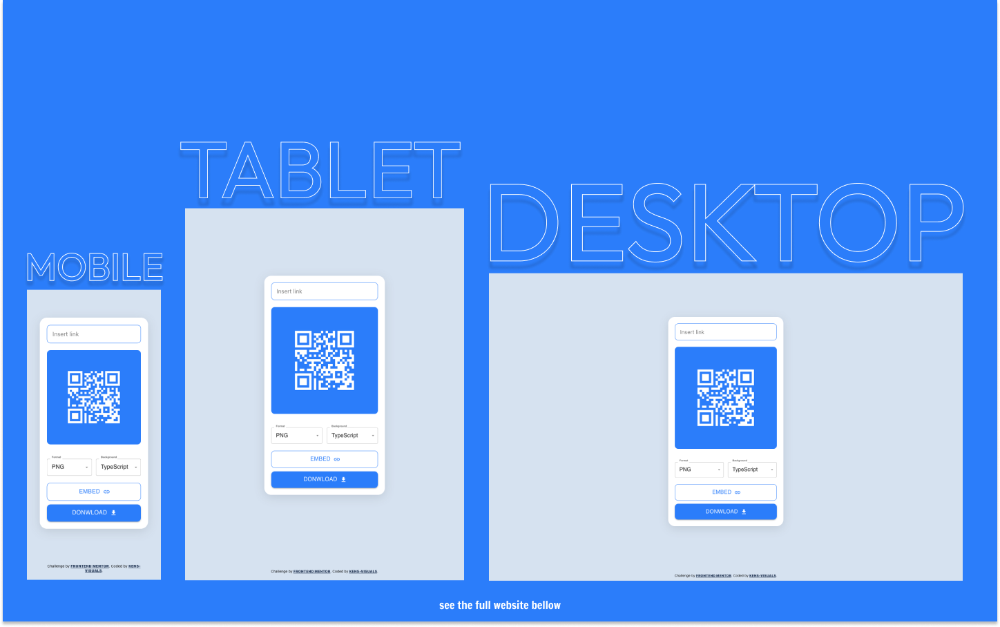
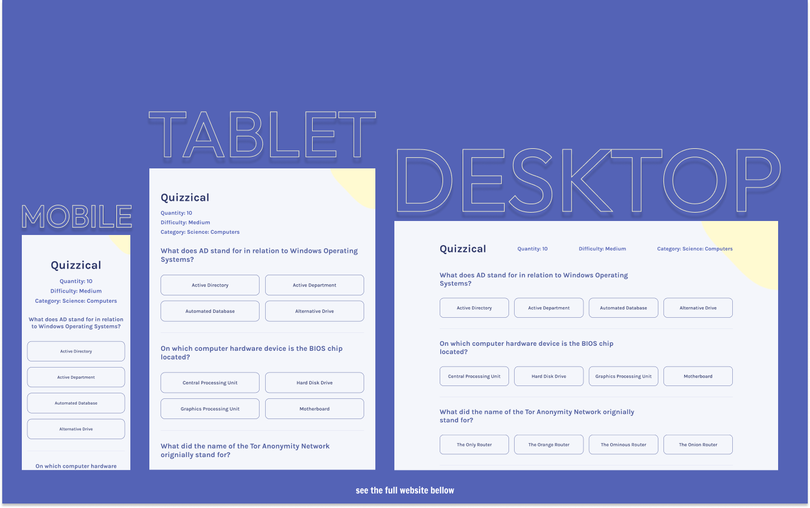
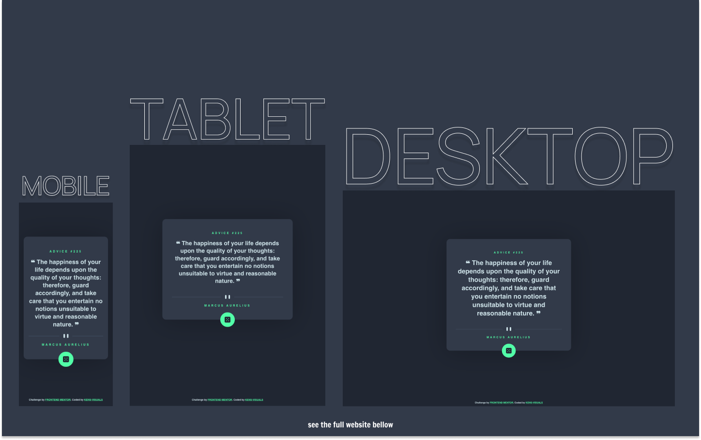

# This is a repo for all my React JS ⚛ projects from all over the place 👨🏻‍💻👾

| Table of Contents                                         |
| --------------------------------------------------------- |
| [QR Code Generator](#qr-code-generator)                   |
| [Quizzical App](#quizzical-app)                           |
| [NFT Preview Card Generator](#nft-preview-card-generator) |
| [Advice Generator App](#advice-generator-app)             |

## QR Code Generator

- Live Site URL: [https://kens-visuals.github.io/qr-code-generator/](https://kens-visuals.github.io/qr-code-generator/)
- Repository URL: [https://github.com/kens-visuals/qr-code-generator](https://github.com/kens-visuals/qr-code-generator)
- Solution URL: [https://www.frontendmentor.io/solutions/qr-code-generator-with-react-and-material-ui-XpZA7o_Ke](https://www.frontendmentor.io/solutions/qr-code-generator-with-react-and-material-ui-XpZA7o_Ke)

## Quizzical App

- Live Site URL: [https://kens-visuals.github.io/quizzical-app/](https://kens-visuals.github.io/quizzical-app/)
- Repository URL: [https://github.com/kens-visuals/quizzical-app](https://github.com/kens-visuals/quizzical-app)

## NFT Preview Card Generator

- Live Site URL: [https://kens-visuals.github.io/nft-preview-generator/](https://kens-visuals.github.io/nft-preview-generator/)
- Repository URL: [https://github.com/kens-visuals/nft-preview-generator](https://github.com/kens-visuals/nft-preview-generator)
- Solution URL: [https://www.frontendmentor.io/solutions/nft-preview-card-generator-built-with-react-and-styledcomponents-iLzEaKy_X](https://www.frontendmentor.io/solutions/nft-preview-card-generator-built-with-react-and-styledcomponents-iLzEaKy_X)

## Advice Generator App

- Live Site URL: [https://kens-visuals.github.io/advice-generator-app/](https://kens-visuals.github.io/advice-generator-app/)
- Repository URL: [https://github.com/kens-visuals/advice-generator-app](https://github.com/kens-visuals/advice-generator-app)
- Solution URL: [https://www.frontendmentor.io/solutions/advice-generator-app-with-react-and-styled-components-CkRsCR7Q9](https://www.frontendmentor.io/solutions/advice-generator-app-with-react-and-styled-components-CkRsCR7Q9)
