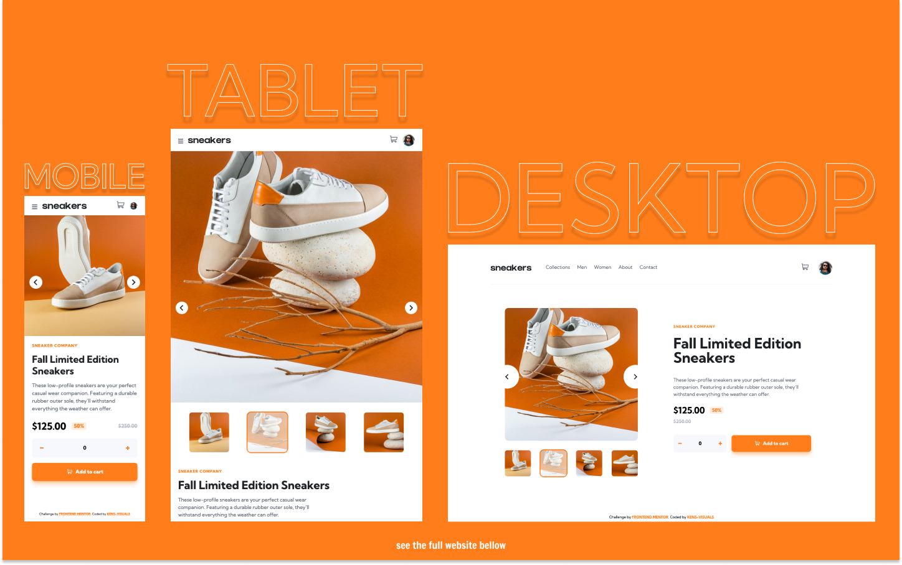
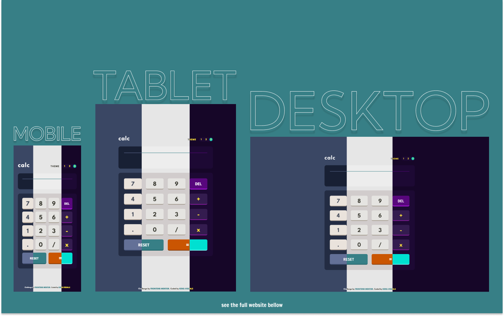
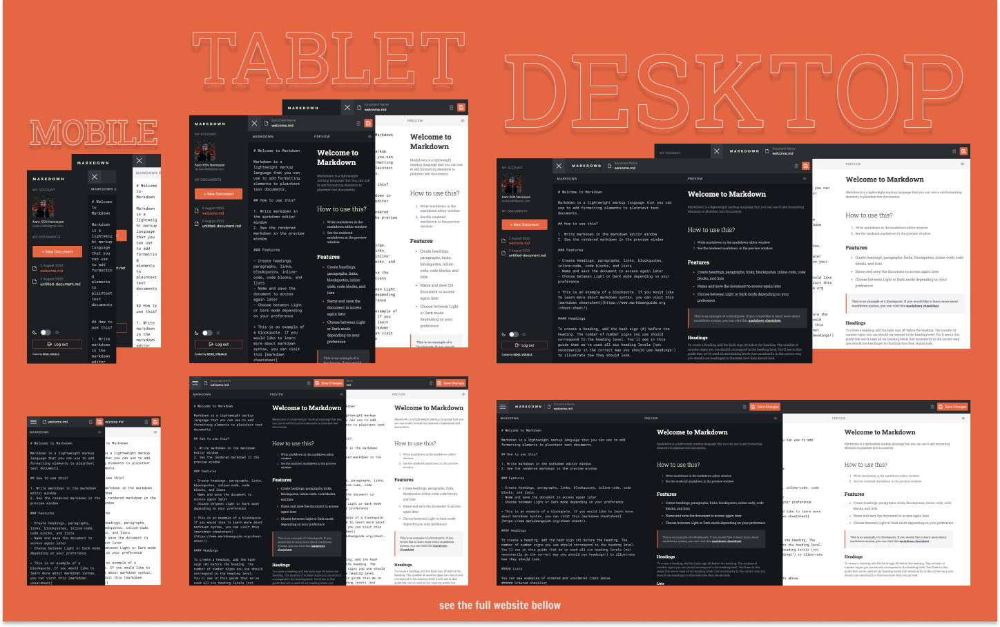

# This is a repo for all my React JS ⚛ projects from all over the place 👨🏻‍💻👾

| Table of Contents                                         |
| --------------------------------------------------------- |
| [QR Code Generator](#qr-code-generator)                   |
| [Quizzical App](#quizzical-app)                           |
| [NFT Preview Card Generator](#nft-preview-card-generator) |
| [Advice Generator App](#advice-generator-app)             |
| [E-Commerce Product Page](#e-commerce-product-page)       |
| [Calculator App](#calculator-app)                         |
| [E-Commerce Product Page](#e-commerce-product-page)       |
| [Calculator App](#calculator-app)                         |
| [Todo App](#todo-app)                                     |
| [Markdown Notes App](#markdown-notes-app)                 |

## QR Code Generator

- Live Site URL: [https://kens-visuals.github.io/qr-code-generator/](https://kens-visuals.github.io/qr-code-generator/)
- Repository URL: [https://github.com/kens-visuals/qr-code-generator](https://github.com/kens-visuals/qr-code-generator)
- Solution URL: [https://www.frontendmentor.io/solutions/qr-code-generator-with-react-and-material-ui-XpZA7o_Ke](https://www.frontendmentor.io/solutions/qr-code-generator-with-react-and-material-ui-XpZA7o_Ke)

## Quizzical App

- Live Site URL: [https://kens-visuals.github.io/quizzical-app/](https://kens-visuals.github.io/quizzical-app/)
- Repository URL: [https://github.com/kens-visuals/quizzical-app](https://github.com/kens-visuals/quizzical-app)

## NFT Preview Card Generator

- Live Site URL: [https://kens-visuals.github.io/nft-preview-generator/](https://kens-visuals.github.io/nft-preview-generator/)
- Repository URL: [https://github.com/kens-visuals/nft-preview-generator](https://github.com/kens-visuals/nft-preview-generator)
- Solution URL: [https://www.frontendmentor.io/solutions/nft-preview-card-generator-built-with-react-and-styledcomponents-iLzEaKy_X](https://www.frontendmentor.io/solutions/nft-preview-card-generator-built-with-react-and-styledcomponents-iLzEaKy_X)

## Advice Generator App

- Live Site URL: [https://kens-visuals.github.io/advice-generator-app/](https://kens-visuals.github.io/advice-generator-app/)
- Repository URL: [https://github.com/kens-visuals/advice-generator-app](https://github.com/kens-visuals/advice-generator-app)
- Solution URL: [https://www.frontendmentor.io/solutions/advice-generator-app-with-react-and-styled-components-CkRsCR7Q9](https://www.frontendmentor.io/solutions/advice-generator-app-with-react-and-styled-components-CkRsCR7Q9)

## E-Commerce Product Page

- Live Site URL: [https://kens-visuals.github.io/ecommerce-product-page/](https://kens-visuals.github.io/ecommerce-product-page/)
- Repository URL: [https://github.com/kens-visuals/ecommerce-product-page](https://github.com/kens-visuals/ecommerce-product-page)
- Solution URL: [https://www.frontendmentor.io/solutions/ecommerce-product-page-built-w-react-and-tailwind-css-Ska7C_9N9](https://www.frontendmentor.io/solutions/ecommerce-product-page-built-w-react-and-tailwind-css-Ska7C_9N9)

## Calculator App

- Live Site URL: [https://kens-visuals.github.io/calculator-app/](https://kens-visuals.github.io/calculator-app/)
- Repository URL: [https://github.com/kens-visuals/calculator-app](https://github.com/kens-visuals/calculator-app)
- Solution URL: [https://www.frontendmentor.io/solutions/calculator-app-built-with-react-and-tailwindcss-S1tYTCe85](https://www.frontendmentor.io/solutions/calculator-app-built-with-react-and-tailwindcss-S1tYTCe85)

## Todo App

- Live Site URL: [https://kens-visuals.github.io/todo-app/](https://kens-visuals.github.io/todo-app/)
- Repository URL: [https://github.com/kens-visuals/todo-app](https://github.com/kens-visuals/todo-app)
- Solution URL: [https://www.frontendmentor.io/solutions/todo-app-built-with-react-and-tailwind-css-rJrsKyJPc](https://www.frontendmentor.io/solutions/todo-app-built-with-react-and-tailwind-css-rJrsKyJPc)

## Markdown Notes App

- Live Site URL: [https://markdown-notes-app-delta.vercel.app/](https://markdown-notes-app-delta.vercel.app/)
- Repository URL: [https://github.com/kens-visuals/markdown-notes-app](https://github.com/kens-visuals/markdown-notes-app)
- Solution URL: [https://www.frontendmentor.io/solutions/markdown-editor-app-built-with-nextjs-tailwindcss-and-firebase-N-SvSRipHi](https://www.frontendmentor.io/solutions/markdown-editor-app-built-with-nextjs-tailwindcss-and-firebase-N-SvSRipHi)
